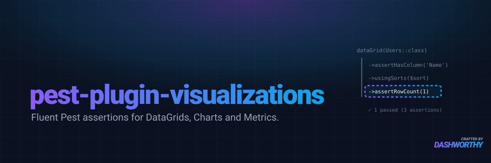

[](https://packagist.org/packages/dashworthy/pest-plugin-visualizations)
[](https://github.com/dashworthy/pest-plugin-visualizations/actions/workflows/tests.yml?query=branch%3A0.x)
[](https://packagist.org/packages/dashworthy/pest-plugin-visualizations)

A [Pest](https://pestphp.com) plugin for testing [Dashworthy Visualizations](https://github.com/dashworthy/visualizations) — expressive, chainable assertions for DataGrids, Charts, and Metrics.

## Installation

```bash
composer require dashworthy/pest-plugin-visualizations --dev
```

## Usage

The plugin exposes three namespaced functions — `dataGrid()`, `chart()`, and `metric()` — that each return a fluent tester. All assertion methods are chainable and return the tester instance.

### DataGrid

```php
use function Dashworthy\PestPluginVisualizations\dataGrid;

it('has the expected schema', function () {
    dataGrid(UserDataGrid::class)
        ->assertColumnCount(3)
        ->assertHasColumn('ID')
        ->assertHasColumn('Name')
        ->assertHasColumn('Email')
        ->assertMissingColumn('Password')
        ->assertColumnIsRowKey('ID')
        ->assertColumnIsSortable('Name')
        ->assertColumnIsFilterable('Email')
        ->assertColumnIsVisible('Name')
        ->assertHasFloatingFilter('Joined On')
        ->assertMissingFloatingFilter('Created At');
});
```

#### Schema assertions

| Method | Description |
|---|---|
| `assertHasColumn(string $field)` | Assert a column with the given field name exists |
| `assertMissingColumn(string $field)` | Assert no column with the given field name exists |
| `assertColumnCount(int $count)` | Assert the total number of columns |
| `assertColumnIsSortable(string $field)` | Assert the column is sortable |
| `assertColumnIsNotSortable(string $field)` | Assert the column is not sortable |
| `assertColumnIsFilterable(string $field)` | Assert the column is filterable |
| `assertColumnIsNotFilterable(string $field)` | Assert the column is not filterable |
| `assertColumnIsVisible(string $field)` | Assert the column is visible (not hidden) |
| `assertColumnIsHidden(string $field)` | Assert the column is hidden |
| `assertColumnIsRowKey(string $field)` | Assert the column is marked as the row key |
| `assertHasFloatingFilter(string $field)` | Assert a floating filter with the given field name exists |
| `assertMissingFloatingFilter(string $field)` | Assert no floating filter with the given field name exists |

#### Data assertions

Use `usingFilterSets()` and `usingSorts()` to configure the query context before asserting on results. Each call replaces the previous context.

```php
use Dashworthy\Visualizations\Builders\FilterBuilder;
use Dashworthy\Visualizations\Data\VisualizationData;
use function Dashworthy\PestPluginVisualizations\dataGrid;

it('filters results correctly', function () {
    DB::table('users')->insert([
        ['name' => 'Andrew', 'email' => 'andrew@example.com'],
        ['name' => 'John',   'email' => 'john@example.com'],
    ]);

    dataGrid(UserDataGrid::class)
        ->usingFilterSets(fn (VisualizationData $data) => $data->addAndFilterSet(
            fn (FilterBuilder $b) => $b->contains('Name', 'Andrew')
        ))
        ->assertRowCount(1)
        ->assertRowMatches(['Name' => 'Andrew'])
        ->assertRowMissing(['Name' => 'John']);
});

it('sorts results correctly', function () {
    DB::table('users')->insert([
        ['name' => 'Zara',   'email' => 'zara@example.com'],
        ['name' => 'Andrew', 'email' => 'andrew@example.com'],
    ]);

    dataGrid(UserDataGrid::class)
        ->usingSorts(fn (VisualizationData $data) => $data->addSortAsc('Name'))
        ->assertRowMatches(['Name' => 'Andrew']);
});
```

| Method | Description |
|---|---|
| `usingFilterSets(Closure $configure)` | Configure filter context for subsequent data assertions |
| `usingSorts(Closure $configure)` | Configure sort context for subsequent data assertions |
| `assertRowCount(int $expected)` | Assert the number of rows returned |
| `assertNoResults()` | Assert the query returns no rows |
| `assertRowMatches(array $expected)` | Assert at least one row matches all given key/value pairs |
| `assertRowMissing(array $expected)` | Assert no row matches all given key/value pairs |

---

### Chart

```php
use function Dashworthy\PestPluginVisualizations\chart;

it('has the expected schema', function () {
    chart(RevenueChart::class)
        ->assertHasLabel('date')
        ->assertHasDataset('revenue')
        ->assertHasDataset('refunds')
        ->assertDatasetCount(2)
        ->assertMissingDataset('costs')
        ->assertMissingFloatingFilter('date_range');
});
```

#### Schema assertions

| Method | Description |
|---|---|
| `assertHasLabel(string $field)` | Assert the chart has a label with the given field name |
| `assertHasNoLabel()` | Assert the chart uses `NullLabel` (no label) |
| `assertHasDataset(string $field)` | Assert a dataset with the given field name exists |
| `assertMissingDataset(string $field)` | Assert no dataset with the given field name exists |
| `assertDatasetCount(int $count)` | Assert the total number of datasets |
| `assertHasFloatingFilter(string $field)` | Assert a floating filter with the given field name exists |
| `assertMissingFloatingFilter(string $field)` | Assert no floating filter with the given field name exists |

#### Data assertions

```php
use Dashworthy\Visualizations\Builders\FilterBuilder;
use Dashworthy\Visualizations\Data\VisualizationData;
use function Dashworthy\PestPluginVisualizations\chart;

it('returns chart data for a specific date', function () {
    DB::table('orders')->insert([
        ['order_date' => '2024-01-01', 'total' => 100.00, 'refunds' => 0.00],
        ['order_date' => '2024-01-02', 'total' => 200.00, 'refunds' => 10.00],
    ]);

    chart(RevenueChart::class)
        ->usingFilterSets(fn (VisualizationData $data) => $data->addAndFilterSet(
            fn (FilterBuilder $b) => $b->equals('date', '2024-01-01')
        ))
        ->assertResultCount(1)
        ->assertResultContains(['date' => '2024-01-01'])
        ->assertResultMissing(['date' => '2024-01-02']);
});
```

| Method | Description |
|---|---|
| `usingFilterSets(Closure $configure)` | Configure filter context for subsequent data assertions |
| `usingSorts(Closure $configure)` | Configure sort context for subsequent data assertions |
| `assertResultCount(int $count)` | Assert the number of result rows |
| `assertNoResults()` | Assert the query returns no results |
| `assertResultContains(array $expected)` | Assert at least one result row matches all given key/value pairs |
| `assertResultMissing(array $expected)` | Assert no result row matches all given key/value pairs |

---

### Metric

```php
use function Dashworthy\PestPluginVisualizations\metric;

it('has the expected schema', function () {
    metric(RevenueMetric::class)
        ->assertHasValue('revenue')
        ->assertMissingFloatingFilter('date_range');
});
```

#### Schema assertions

| Method | Description |
|---|---|
| `assertHasValue(string $field)` | Assert the metric's value has the given field name |
| `assertHasFloatingFilter(string $field)` | Assert a floating filter with the given field name exists |
| `assertMissingFloatingFilter(string $field)` | Assert no floating filter with the given field name exists |

#### Data assertions

```php
use Dashworthy\Visualizations\Builders\FilterBuilder;
use Dashworthy\Visualizations\Data\VisualizationData;
use function Dashworthy\PestPluginVisualizations\metric;

it('aggregates revenue correctly', function () {
    DB::table('orders')->insert([
        ['order_date' => '2024-01-01', 'total' => 100.00],
        ['order_date' => '2024-01-02', 'total' => 200.00],
        ['order_date' => '2024-01-03', 'total' =>  50.00],
    ]);

    metric(RevenueMetric::class)->assertAggregateEquals(350.0);
});

it('filters the aggregate via floating filter', function () {
    DB::table('orders')->insert([
        ['order_date' => '2024-01-01', 'total' => 100.00],
        ['order_date' => '2024-01-02', 'total' => 200.00],
    ]);

    metric(RevenueWithFloatingFiltersMetric::class)
        ->usingFilterSets(fn (VisualizationData $data) => $data->addAndFilterSet(
            fn (FilterBuilder $b) => $b->equals('date_range', '2024-01-01')
        ))
        ->assertAggregateEquals(100.0);
});
```

| Method | Description |
|---|---|
| `usingFilterSets(Closure $configure)` | Configure filter context for subsequent data assertions |
| `assertAggregateEquals(mixed $expected)` | Assert the aggregate value equals the expected value |
| `assertAggregateNull()` | Assert the aggregate value is null |

## Testing

```bash
composer test
```

## License

The MIT License (MIT). Please see [License File](LICENSE.md) for more information.
